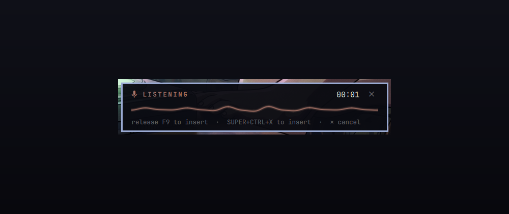

# voxhud

A minimalist, theme-aware HUD for [Voxtype](https://voxtype.io) dictation on
Omarchy. Hold **F9**, talk, let go — and see LISTENING → PROCESSING → DONE in
your theme's colors, with the real keys that stop and insert written
underneath, and a ✕ to cancel.



Voxtype keeps doing everything it does now — the keybindings, the
transcription and the typing are untouched. voxhud replaces the overlay and
the bar icon:

- **No dead air.** Voxtype's own overlay is driven by microphone audio, so it
  vanishes the moment you release the key and the text appears seconds later
  "from nowhere". voxhud follows the daemon's state instead, so PROCESSING
  stays on screen until the text has landed.
- **A waveform that answers to your voice**, measured by voxhud's own meter so
  it moves from the first word.
- **Your theme, live.** Colors come from the Omarchy shell's palette and
  follow `omarchy theme set` without a restart.
- **The keys, not a guess.** The hint line is read from your live Hyprland
  bindings, so it stays right if you ever rebind.
- **A bar icon that never disappears** (Omarchy's stock one hides itself while
  transcribing). Click it for your last three takes and your dictionary.

## Requirements

- Omarchy Quattro (the Quickshell-based `omarchy-shell`)
- [Voxtype](https://voxtype.io) — `omarchy voxtype install`
- `pipewire` (`pw-record`), `python3` 3.11+, `hyprctl`, `journalctl`
- `wl-clipboard` for the copy buttons; `jq` and `rsync` for the setup script

## Install

```sh
omarchy plugin add https://github.com/aashbury/voxhud.git --enable
```

That gets you the HUD, the bar icon and the popup. Two things it deliberately
does not do, because installing a plugin should not rewrite your config:
turn Voxtype's own overlay off (otherwise you get two), and hide Omarchy's
built-in dictation indicator (which disappears mid-transcription). A bundled
script does both, and puts the `voxhud` CLI on your PATH:

```sh
~/.config/omarchy/plugins/io.github.aashbury.voxhud/install.sh
```

Everything it changes, and what `uninstall.sh` puts back:

| Change | Why |
|---|---|
| the widget in your bar (center) | enables the service, the HUD and the icon |
| Omarchy's `Dictation` indicator hidden | it goes invisible while processing; voxhud's icon replaces it |
| `osd.enabled = false` in Voxtype's config | turns Voxtype's own overlay off (the daemon restarts once) |
| `~/.local/bin/voxhud` | the CLI |

Nothing under `~/.config/hypr` is touched. F9 and Super+Ctrl+X stay exactly as
Omarchy set them.

To work on it instead, clone anywhere and run `./install.sh` from the clone;
it copies itself into place.

## Use

Hold **F9** and talk; release to insert. **Super+Ctrl+X** toggles instead.
While the HUD is up, click **✕** (or middle-click the bar icon) to cancel and
insert nothing.

```sh
voxhud demo tour           # see every state without speaking
voxhud status              # what the service sees
voxhud recent              # your last three takes
voxhud copy 2              # copy the second one
voxhud dictionary          # replacements, filler words, hints
voxhud dictionary add "oh marky" Omarchy
voxhud doctor              # check the install
```

Left-click the bar icon for the popup, right-click for the preview.

## Settings

In Omarchy's bar settings for the widget, or:

```sh
omarchy bar set io.github.aashbury.voxhud <key> <value>
```

| key | default | |
|---|---|---|
| `hudEnabled` | `true` | draw the HUD (the icon keeps tracking state either way) |
| `position` | `bottom` | `bottom` or `top` |
| `meter` | `line` | `line` (one waveform, glows) or `bars` (level bars) |
| `brackets` | `false` | targeting-reticle corners around the card (sharp themes only) |
| `showLegend` | `true` | the key hints line |
| `showTarget` | `true` | name the focused window while processing |

Reserved for later, not implemented: `showTranscript` (show the text as it is
inserted; needs a hook in Voxtype's `output.post_process.command`),
`bindingsMode: wrapper` (route the same keys through `voxhud` so the HUD knows
push-to-talk from toggle), `cancelKey`.

## Recent takes

The popup lists your last three takes with a copy button, read from Voxtype's
own journal line (`Transcribed: "…"`), so nothing in Voxtype is changed and
nothing is written to disk — the list lives in the shell's memory. `voxhud
recent` prints them; `voxhud copy 2` copies the second. The same log line is
how an empty take shows as **NOTHING HEARD** rather than DONE.

## Dictionary

The popup's DICTIONARY section is everything Voxtype does to your words, read
live from `~/.config/voxtype/config.toml` so you can see what's there before
adding more: replacements (`text.replacements`, case-insensitive: hear the
left side, type the right side), the filler words it drops
(`text.filter_filler_words`, built-in list unless you set `text.filler_words`),
spoken punctuation (`text.spoken_punctuation`) and vocabulary hints
(`whisper.initial_prompt`). The pencil opens the file in your editor for
anything beyond that. Changes are written with `voxtype config set/unset`, so
the file keeps its comments, and need a daemon restart — the popup offers one.

## If the HUD says CLIP

The meter shows how far above the room's noise floor you are; a red **CLIP**
tag means the microphone input is saturating, which also hurts transcription.
That is the system's mic gain, not the HUD — lower it:

```sh
wpctl set-volume @DEFAULT_AUDIO_SOURCE@ 0.25    # WirePlumber remembers it
```

(On one laptop here the ALSA `Capture` and `Internal Mic Boost` controls both
defaulted to +30 dB — 60 dB of gain — and clipped on room noise.)

## Known limits

- Silence takes Voxtype ~7 s (it retries with beam search) before it gives up;
  the HUD shows PROCESSING the whole time, then NOTHING HEARD. Whisper's
  smaller models sometimes hallucinate a line out of silence, and Voxtype
  types it — that is upstream, not voxhud.
- Push-to-talk and toggle can't be told apart without routing the keys through
  voxhud (`bindingsMode: wrapper`, reserved), so the hint line names both ways
  to insert.

## Uninstall

```sh
~/.config/omarchy/plugins/io.github.aashbury.voxhud/uninstall.sh
```

That restores Voxtype's overlay and Omarchy's indicator, removes the widget,
the CLI symlink and the plugin itself. `omarchy plugin remove
io.github.aashbury.voxhud` on its own removes the plugin but leaves the other
two settings as voxhud set them.

Your dictionary stays in `~/.config/voxtype/config.toml`.

## Dev loop

Edit your clone → `./install.sh` → `voxhud demo tour`. Errors:
`journalctl --user -t omarchy-shell -f`.

The shell's hot reload notices the copy but in practice keeps running the old
QML for the service and the popup, so after editing any `.qml` run `omarchy
restart shell` (the bar blinks once). Scripts under `bin/` are picked up on the
next take without a restart.

## Licence

MIT. See [LICENSE](LICENSE).
